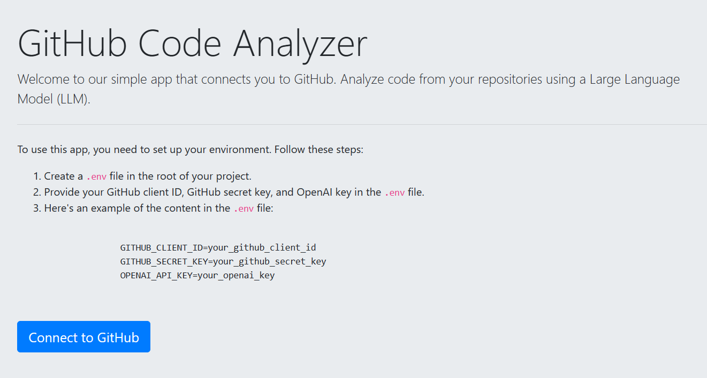

<!-- PROJECT LOGO -->
<br />
<div align="center">

  <a href="https://github.com/othneildrew/Best-README-Template">
    
  </a>

  <h3 align="center">AI-Powered Code Reviewer</h3>

  <p align="center">
    An awesome companion to help you code better!
    <br />
    <br />
    <br />
    <a href="https://youtu.be/opXekY14W9E">View Demo</a>
  
</div>


<!-- TABLE OF CONTENTS -->
<details>
  <summary>Table of Contents</summary>
  <ol>
    <li>
      <a href="#about-the-project">roject DescriptionP</a>
      <ul>
        <li><a href="#features">Features</a></li>
        <ul>
        <li><a href="#built-with">Built With</a></li>
      </ul>
      </ul>
    </li>
    <li>
      <a href="#getting-started">Getting Started</a>
      <ul>
        <li><a href="#prerequisites">Prerequisites</a></li>
        <li><a href="#installation">Installation</a></li>
      </ul>
    </li>
    <li><a href="#usage">Usage</a></li>
    <li><a href="#roadmap">Roadmap</a></li>
    <li><a href="#contributing">Contributing</a></li>
    <li><a href="#license">License</a></li>
    <li><a href="#contact">Contact</a></li>
    <li><a href="#acknowledgments">Acknowledgments</a></li>
  </ol>
</details>


<!-- ABOUT THE PROJECT -->
## Project Description
This project is an innovative code review system, meticulously designed to transform the coding development experience. At its core, it harnesses the power of cutting-edge Language Models (LLM),particularly ChatGPT, to offer an automated, effortless, and efficient code review process.

This advanced system empowers developers to seamlessly connect their GitHub repositories, enabling IntelliReview to access and analyze their code. By leveraging the capabilities of sophisticated AI model, it meticulously scrutinizes code, providing insightful and actionable feedback that significantly enhances code quality.

## Features

- **GitHub Integration:**
  Connect IntelliReview to your GitHub repositories effortlessly using OAuth authentication.

- **AI-Powered Code Reviews:**
  Enjoy automated code reviews powered by state-of-the-art language models, ensuring comprehensive and context-aware feedback.

- **Intuitive Insights:**
  Receive clear and actionable insights into code quality, best practices, and potential improvements.

- **Efficient Collaboration:**
  Facilitate collaboration among development teams with streamlined and intelligent code review processes.


### Built With
* Python
* Langchain
* FastAPI
* HTML
* Gihtub OAuth authentication


<!-- GETTING STARTED -->
## Getting Started

To get started, sign up for an OpenAI account and generate an API key. This key will allow you to access and utilize the OpenAI API effectively. Finally, clone the repository to your local machine using the `git clone` command with the repository URL.
```sh
git clone https://github.com/OwusuBlessing/Code-Analysis-LLM.git
```

### Prerequisites
To set up a virtual environment, you can choose to use either Python's built-in virtual environment tools or Anaconda, depending on your preference. Open your terminal and navigate to the cloned repository directory. From there, create your virtual environment using your preferred method
* Using Python's venv Module write the following command one after the other:
  ```sh
  python -m venv myenv
  
  myenv\Scripts\activate
  
  source myenv/bin/activate

  ```
  

* Using Anaconda write the following command one after the other:
  ```sh
  conda create --name myenv
  
  conda activate myenv
  ```


After setting up your environment, ensure you have:
- An OpenAI account for API access.
- A GitHub account for repository integration.
- Python installed on your machine for running the project.

### Step 1: Sign Up for OpenAI and Generate an API Key

1. Visit [OpenAI's website](https://openai.com/) and sign up for an account.
2. Navigate to the API section and generate a new API key.
3. Safely store the API key for later use.

### Step 2: Create a GitHub OAuth App

IntelliReview requires GitHub integration:

1. Log into [GitHub](https://github.com/) and access your settings.
2. In the 'Developer settings', go to 'OAuth Apps'.
3. Click 'New OAuth App'.
4. Fill out the application details:
    - **Application Name**: "IntelliReview" (or a name of your choice).
    - **Homepage URL**: `http://localhost` (for local development).
    - **Application Description**: Briefly describe the app.
    - **Authorization callback URL**: `http://localhost/callback` (for local testing).
5. Click 'Register application'.

### Step 3: Clone the Repository

Clone IntelliReview to your local machine:

```sh
git clone https://github.com/OwusuBlessing/Code-Analysis-LLM.git
cd Langchain-Project


### Installation


1. Get your API Key at [https://platform.openai.com/](https://platform.openai.com/)
2. Clone the repo
   ```sh
   git clone https://github.com/OwusuBlessing/Langchain-Project.git
   ```
3. Install packages after activating your virtual environment and run:
   ```sh
   pip install -r requirements.txt
   ```
4. Enter your API toknes  in `.env`

To copy github client id and secret key;
- Select Your App: Find and select the OAuth app you created for your project.
- Copy Client ID: The Client ID will be visible on the app details page. You can copy it by clicking on it or using Ctrl+C (Windows) or Cmd+C (Mac).
- Copy Secret Key: For the Client Secret, click the 'Generate a new client secret' button if you haven't already, then copy the generated secret. Remember, for security reasons, the client secret isn't displayed again after you navigate away from the page, so make sure to save it securely.

open `.env` file  and paste your tokens

   ```env
   OPENAI_API_KEY="ENTER YOUR OPENAI API"
   GITHUB_CLIENT_ID = "Enter your github client id"
   GITHUB_SECRET_KEY="Enter your gthub secret key"

   ```

<!-- USAGE EXAMPLES -->
## Usage

This application simplifies the code review process, making it efficient and intelligent.
The potential for generating valuable content for code optimization is substantial, determined by the precision and creativity behind the project where ChatGPT is prompted  behind the scenes to process and analyze code, encompassing areas such as code improvement, optimization, test case development, and bug identification.


<!-- CONTRIBUTING -->
## Contributing

Contributions are what make the open source community such an amazing place to learn, inspire, and create. Any contributions you make are **greatly appreciated**.

If you have a suggestion that would make this better, please fork the repo and create a pull request. You can also simply open an issue with the tag "enhancement".
Don't forget to give the project a star! Thanks again!

1. Fork the Project
2. Create your Feature Branch (`git checkout -b feature/AmazingFeature`)
3. Commit your Changes (`git commit -m 'Add some AmazingFeature'`)
4. Push to the Branch (`git push origin feature/AmazingFeature`)
5. Open a Pull Request


<!-- CONTACT -->
## Contact
Name - Owusu Samule Blessing
Email - owususammy509@gmail.com

<p align="right">(<a href="#readme-top">back to top</a>)</p>


<!-- ACKNOWLEDGMENTS -->
## Acknowledgments

Here is a list of resources that proven to be really helpful in implementing this project

* [Langchain documentation](https://python.langchain.com/docs/get_started/introduction/)
* [Github OAuth with FastAPI](https://www.youtube.com/watch?v=Pm938UxLEwQ)
* [FastAPI documentation](https://fastapi.tiangolo.com/)
<p align="right">(<a href="#readme-top">back to top</a>)</p>

